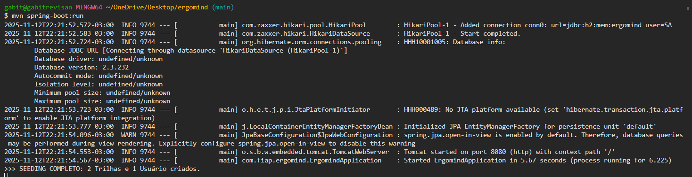
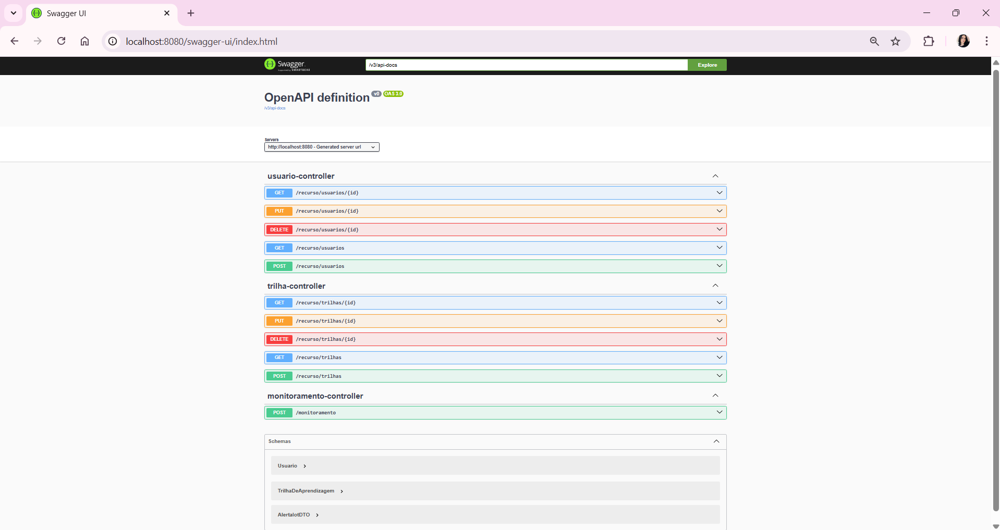
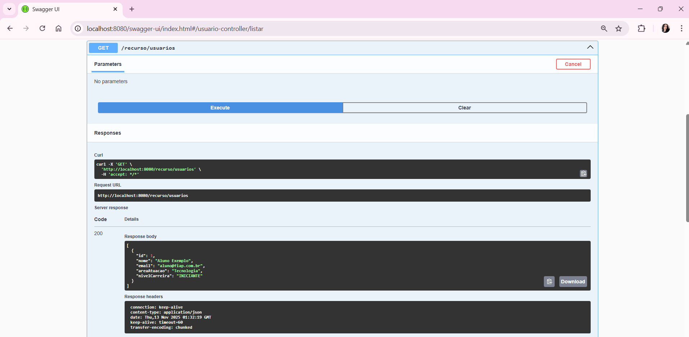
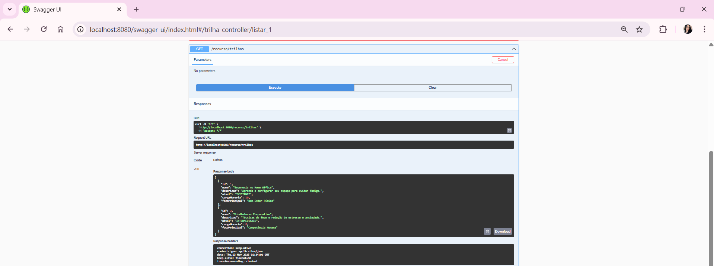
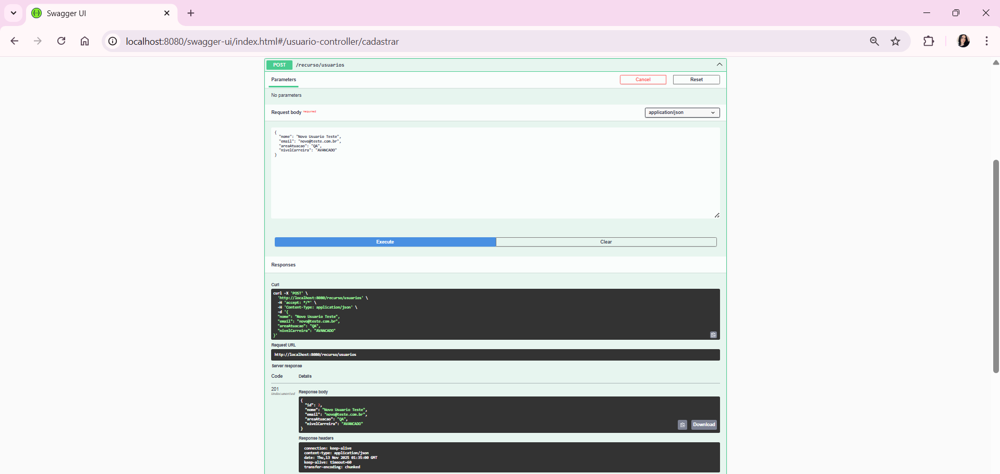
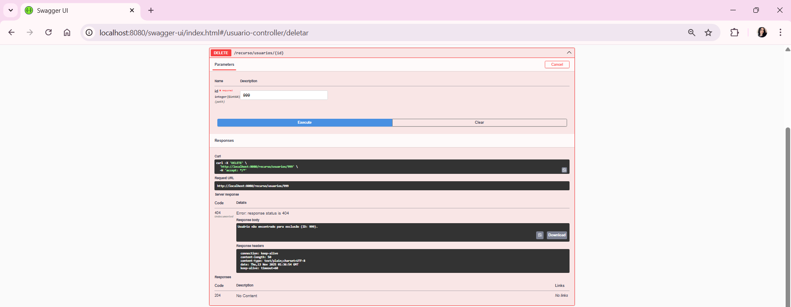
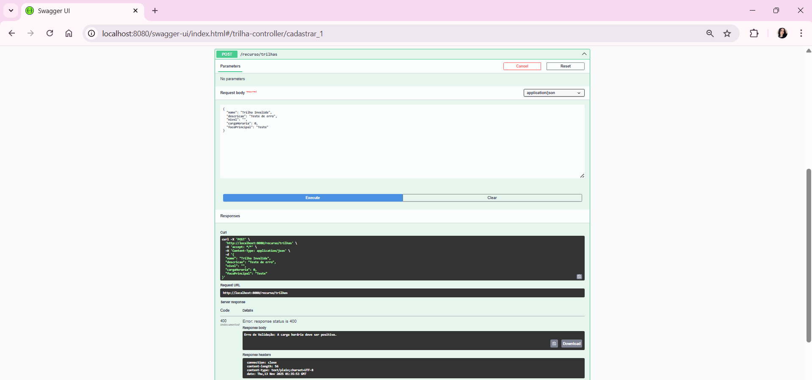
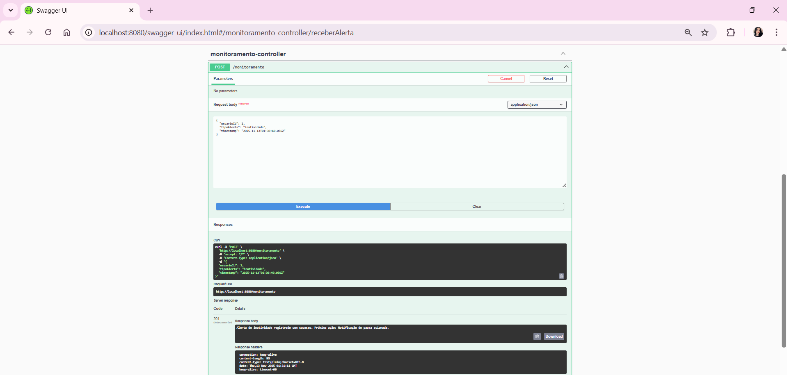
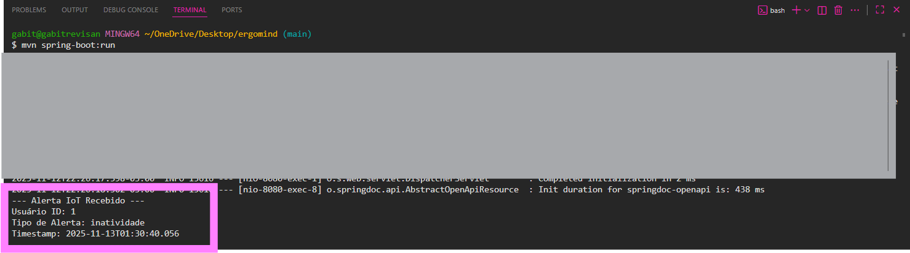

# 🌍 ErgoMind - API de Gestão de Bem-Estar (SOA/Web Services)

## 👩🏻‍💻 Desenvolvido por 👨🏻‍💻
Gabriela Trevisan (RM99500), Eduardo Araujo (RM99758) e Rafael Franck (RM550875) - 3ESPW

---

## 🎯 1. Identificação e Conceito Central

| Item | Descrição |
| :--- | :--- |
| **Plataforma** | ErgoMind - Plataforma de Bem-Estar e Produtividade. |
| **Conceito Central** | API de Gestão de Usuários e Trilhas de Aprendizagem, responsável por receber alertas do **IoT** e iniciar o fluxo de pausa/requalificação (SOA). |
| **Problema Solucionado** | Fadiga e má ergonomia no trabalho remoto/híbrido. |
| **Alinhamento ODS** | **ODS 4** (Educação de Qualidade), **ODS 8** (Trabalho Decente e Bem-Estar), e **ODS 9** (Inovação e Infraestrutura). |
| **Arquitetura** | **SOA (Arquitetura Orientada a Serviços)** e Camadas (Controller → Service → Repository). |

---

## ⚙️ 2. Detalhamento Técnico e Entregáveis

### 2.1. Funcionalidades Essenciais (2 CRUDs Completos)

A API implementa a gestão completa para os recursos principais:

| Recurso | Rota Base | Métodos Implementados |
| :--- | :--- | :--- |
| **Usuário** | `/recurso/usuarios` | `GET`, `POST`, `PUT`, `DELETE` (CRUD Completo) |
| **Trilha de Aprendizagem** | `/recurso/trilhas` | `GET`, `POST`, `PUT`, `DELETE` (CRUD Completo) |

### 2.2. Integração SOA: Endpoint IoT (Critério de Aceite)

Este é o ponto de integração com o módulo IoT/Hardware.

| Endpoint | Método | Descrição | Status de Sucesso |
| :--- | :--- | :--- | :--- |
| `/monitoramento` | `POST` | Recebe o JSON de alerta do IoT (ex: inatividade) e aciona o processamento da pausa. | **201 Created** |

### 2.3. Tratamento de Erros e Validações

* **Validação:** Uso de **Bean Validation** (`@NotBlank`, `@Min`, `@Email`) capturado pelo `@RestControllerAdvice` para retornar **400 Bad Request**.
* **Exceções Customizadas:** Utilização de `UsuarioNaoEncontradoException` e `TrilhaNaoEncontradaException` para retornar **404 Not Found**.

---

## 💻 3. Infraestrutura e Execução Local

### 3.1. Stack Tecnológica

* **Java Version:** 17
* **Spring Boot Version:** 3.5.7
* **Persistência:** Spring Data JPA / Hibernate
* **Documentação:** SpringDoc OpenAPI (Swagger UI)

### 3.2. Configuração do Banco de Dados: H2 (Ambiente de Teste) ⚠️

O projeto foi configurado originalmente para o Oracle FIAP, mas, devido ao erro persistente de **bloqueio de conta (`ORA-28000`)** que impedia a inicialização do contexto JPA, o projeto foi temporariamente configurado para usar o **H2 Database (em memória)**.

* **Objetivo:** Permitir que o aplicativo inicie e que todos os endpoints de SOA/REST (CRUDs, Validações, Exceções e o `POST /monitoramento`) sejam testados e demonstrados.
* **Seeding:** O código de inserção de dados (`seeds`) foi movido do `data.sql` para um **`CommandLineRunner`** em Java, garantindo que os dados sejam carregados corretamente após a criação das tabelas em memória, resolvendo o erro de *timing*.

### 3.3. Comandos para Execução

1.  **Executar o Servidor:** Use o comando Maven para iniciar o servidor.
    ```bash
    mvn spring-boot:run
    ```

2. A API estará acessível em `http://localhost:8080` e a documentação interativa em `http://localhost:8080/swagger-ui.html`.

---

## 📔 4. Exemplos de Requisição para Teste (Postman/Swagger)

| Ação | Método | Rota | JSON Body (Exemplo) | Status |
| :--- | :--- | :--- | :--- | :--- |
| **Teste SOA/IoT** | `POST` | `/monitoramento` | `{"usuarioId": 1, "tipoAlerta": "inatividade", "timestamp": "2025-11-12T22:30:00"}` | **201** |
| **Criar Usuário** | `POST` | `/recurso/usuarios` | `{"nome": "Dev Teste", "email": "dev@teste.com", "areaAtuacao": "TI", "nivelCarreira": "PLENO"}` | **201** |
| **Atualizar Trilha** | `PUT` | `/recurso/trilhas/1` | `{"nome": "Ergonomia - Nível 1", "descricao": "Novo foco", "nivel": "INICIANTE", "cargaHoraria": 12, "focoPrincipal": "Físico"}` | **200** |
| **Erro 404** | `DELETE` | `/recurso/usuarios/999` | (Nenhum) | **404** (Customizada) |

---

## 🖼️ 5. Evidências de Teste de Funcionalidade (QA) 

Para comprovar a execução do ciclo de vida completo da API (CRUD, Validação e Integração SOA), as seguintes evidências foram capturadas:

<table style="width: 100%;">
    <thead>
        <tr>
            <th>Endpoint Testado</th>
            <th>Cenário Verificado</th>
            <th>Evidência</th>
        </tr>
    </thead>
    <tbody>
        <tr>
            <td>Execução</td>
            <td>Startup (Seeding Concluído no Terminal)</td>
            <td></td>
        </tr>
        <tr>
            <td>Geral</td>
            <td>Swagger UI Carregado</td>
            <td></td>
        </tr>
        <tr>
            <td>GET /recurso/usuarios</td>
            <td>Listagem de Usuários (Seed Carregado)</td>
            <td></td>
        </tr>
        <tr>
            <td>GET /recurso/trilhas</td>
            <td>Listagem de Trilhas (Seeds Carregadas)</td>
            <td></td>
        </tr>
        <tr>
            <td>POST /recurso/usuarios</td>
            <td>Criação de Usuário (Status 201 Created)</td>
            <td></td>
        </tr>
        <tr>
            <td>DELETE /recurso/usuarios/{id}</td>
            <td>Tratamento de Exceção (Status 404 Not Found)</td>
            <td></td>
        </tr>
        <tr>
            <td>POST /recurso/trilhas</td>
            <td>Tratamento de Validação (Status 400 Bad Request)</td>
            <td></td>
        </tr>
            <tr>
            <td>POST /monitoramento</td>
            <td>Integração SOA/IoT (Status 201 Created)</td>
            <td></td>
        </tr>
        <tr>
            <td>Alerta IoT</td>
            <td>Alerta IoT de Inatividade Emitido no Terminal</td>
            <td></td>
        </tr>
    </tbody>
</table>
